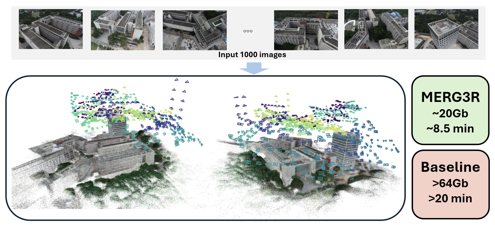

<div align="center">

# MERG3R: A Divide-and-Conquer Approach to Large-Scale Neural Visual Geometry

Leo Kaixuan Cheng, Abdus Shaikh, Ruofan Liang, Zhijie Wu, Yushi Guan, Nandita Vijaykumar

*CVPR 2026*

[Project Page](https://leochengkx.github.io/MERG3R/) | [Paper](https://arxiv.org/abs/2603.02351)



</div>


---

MERG3R is a divide-and-conquer pipeline for large-scale neural visual geometry reconstruction.
It scales base geometry models (`VGGT`, `Pi3`) to long, unordered image collections by:
- ordering and partitioning images into overlapping subsets,
- running local subset reconstruction,
- aligning subsets globally,
- refining with global bundle adjustment.

## Highlights

- Supports large unordered image sets via subset reconstruction + merging.
- Works with multiple base models: `vggt`, `pi3`.
- Exports COLMAP text reconstruction and point cloud outputs.

## Repository Layout

```text
.
├── main.py                     # core pipeline entrypoint
├── run.sh                      # recommended starting script
├── colmap_export.py            # COLMAP export helpers
├── algos/                      # sequence split, alignment, BA, tracking
├── vggt/                       # VGGT model code
├── pi3/                        # Pi3 model code
├── eval/                       # evaluation scripts
├── colmap_to_nerf.py           # convert COLMAP txt -> transforms.json
└── requirements.txt
```

## Installation

1. Create a Python 3.10+ environment.
2. Install runtime dependencies:

```bash
pip install -r requirements.txt
```

3. Follow [DINOv3](https://github.com/facebookresearch/dinov3) to clone the repo and get the url. Set the environment variables `MERG3R_DINOV3_REPO_DIR` and `MERG3R_DINOV3_WEIGHTS_URL` in `run.sh`. 

Notes:
- Model weights are downloaded from Hugging Face on first run.
- CUDA is required for the current pipeline.

## Data Format

Expected scene directory format:

```text
/path/to/scene/
└── images/
    ├── 000.png
    ├── 001.png
    └── ...
```

## Quick Start

Run a default reconstruction:

```bash
bash run.sh data/tanks_and_temples/Barn/images outputs/barn/run01
```

Run with custom `main.py` overrides:

```bash
bash run.sh \
  data/tanks_and_temples/Barn/images \
  outputs/barn/vggt_run01 \
  --model vggt \
  --num_images -1 \
  --subset_size 75
```

`run.sh` is intentionally minimal and accepts only:

```bash
bash run.sh <dataset_path> <output_dir> [extra main.py args...]
```

`run.sh` defaults:

- `--model pi3`
- `--sequence_type shortest_path`
- `--alignment_type weighted_iterative`
- `--subset_size 100`
- `--overlap 5`
- `--num_images 150`
- `--splitting_type interleave`
- `--tracking_type graph`
- `--lr 3e-3 --epoch 300`
- `--max_reproj 8.0`
- `--global_ba` enabled

You can set `--splitting_type` to one of `interleave`, `original`, `zigzag`, or `original_threshold` depending on your use case. 

## Direct Pipeline Invocation

You can call `main.py` directly:

```bash
python main.py \
  --dataset data/tanks_and_temples/Barn/images \
  --output_dir outputs/barn/direct_run \
  --model pi3 \
  --sequence_type shortest_path \
  --alignment_type weighted_iterative \
  --subset_size 100 \
  --overlap 5 \
  --splitting_type interleave \
  --tracking_type graph \
  --global_ba \
  --lr 3e-3 \
  --epoch 300
```

## Outputs

A run writes artifacts under `<output_dir>`, typically:

```text
outputs/.../
├── config.json
├── computation_stats.txt
├── points.ply
└── colmap/
    ├── cameras.txt
    ├── images.txt
    └── points3D.txt
```

## Evaluation

1. Convert COLMAP text outputs to `transforms.json`:

```bash
python colmap_to_nerf.py \
  --text outputs/barn/direct_run/colmap \
  --images data/tanks_and_temples/Barn/images \
  --out outputs/barn/direct_run/transforms.json \
  --convention opengl
```

2. Pose evaluation:

```bash
python eval/evaluate_poses.py \
  --tgt data/tanks_and_temples/Barn/gt_transforms.json \
  --pred outputs/barn/direct_run/transforms.json \
  --path outputs/barn/direct_run/results.txt
```

3. Relative pose metrics:

```bash
python eval/evaluate_error.py \
  --tgt data/tanks_and_temples/Barn/gt_transforms.json \
  --pred outputs/barn/direct_run/transforms.json \
  --path outputs/barn/direct_run/relative_metrics.txt
```

## Using Alternative Backbones
1. Modify the load_model function in algos/utils.py

```
def load_model(model_name="vggt", device=None):
    ...
    
    if model_name == 'vggt':
        model = VGGT.from_pretrained("facebook/VGGT-1B")
    elif model_name == 'pi3':
        model = Pi3.from_pretrained("yyfz233/Pi3")
    elif model_name == 'YOUR_MODEL':
        model = YOUR_MODEL
    
    ...
```

2. Modify the run_inference_step_by_step function in algos/utils.py

```
def run_inference_step_by_step(model, batches, size_hw, device, need_features=False):
    ...
    if isinstance(model, VGGT):
        ...
    elif isinstance(model, Pi3):
        ...
    elif isinstance(model, YOUR_MODEL):
        ...
```
The `prediction` dictionary must have at least 'extrinsic', 'world_points', 'depth_conf', 'intrinsic', and 'depth' fields populated for the pipeline to work. Please refer to the existing code for implementation details.


## License

See `LICENSE.txt`.

## Citation

If you use this codebase in your research, please cite:

```bibtex
@article{cheng2025merg3r,
  title   = {{MERG3R}: A Divide-and-Conquer Approach to Large-Scale Neural Visual Geometry},
  author  = {Cheng, Leo Kaixuan and Shaikh, Abdus and Liang, Ruofan and
             Wu, Zhijie and Guan, Yushi and Vijaykumar, Nandita},
  journal = {arXiv preprint},
  year    = {2026}
}
```

## Acknowledgements

- [DINOv3](https://github.com/facebookresearch/dinov3)
- [VGGT](https://github.com/facebookresearch/vggt)
- [Pi3](https://github.com/yyfz/Pi3)
- [LightGlue](https://github.com/cvg/LightGlue)
